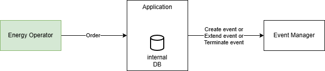

# Cucumber typescript test suite example
This project provides an example of a test suite for our project

## Architecture of the application


The application interacts with 2 systems:
1. takes as input the orders from the energy operator
2. when certain conditions are met, acts on the events in our platform sending requests to the Event Manager

Note: the "Energy Operator" (in green) is an external service, while both the "Application" and the "Event Manager" are part of our imaginary platform

## Requirements from the business/product

- Our application exposes a rest API
- The energy operator deliver to our endpoint its orders, setting in the body of the POST request a json such as:
    ```json
    {
        "action": "CREATE|UPDATE|EXTEND",
        "start_time": "2026-03-17T10:30:00.000Z",
        "end_time": "2026-03-17T10:50:00.000Z",
        "power": 10,
        "site_name": "SITE_1"
    }
    ```
- For the 3 possible actions:
    - The internal DB is used to convert the "site_name" in the order to a "site_id" (the identifier is used in the platform to recognize the sites)
    - CREATE
        - This action is possible only if there are no active events in Event Manager for the same site(active event = event with end_time > now)
        - If an active event is retrieved, the application will not create a new event
        - Otherwise, create the event in the Event Manager sending a POST request with a body such as:
        ```json
        {
            "start_time": "2026-03-17T10:30:00.000Z",
            "end_time": "2026-03-17T10:50:00.000Z",
            "power": 10,
            "site_id": "74b62e61-9250-41dc-beb8-3fc16701e59b"
        }
        ```
    - EXTEND
        - This action is possible only if there is an active event in Event Manager for the same site
        - If no active event is retrieved, the application will just exit logging a warning 
        - If there is an active event, if the end_time is > now() it will overwrite the one in the existing event with a PUT request providing this information:
        ```json
        {
            "end_time": "2026-03-17T11:50:00.000Z",
            "site_id": "74b62e61-9250-41dc-beb8-3fc16701e59b"
        }
        ```
    - TERMINATE
        - Same conditions as for the EXTEND, but in this case the action condition is that the end_time specified in the order is = now(). At this point the end_time of the event will be set to the current time and the "terminated" flag will be set to true performing a PUT request with the body:
        ```json
        {
            "end_time": "2026-03-17T10:40:00.000Z",
            "site_id": "74b62e61-9250-41dc-beb8-3fc16701e59b",
            "terminated": true
        }
        ```
- The Event Management service offers an API with also a GET endpoint. It can be used to assess the events scheduled in the platform and it will return a response like:
```json
{
    "message": "OK",
    "status": 200,
    "data": [{
        "start_time": "2026-03-17T10:30:00.000Z",
        "end_time": "2026-03-17T10:50:00.000Z",
        "power": 10,
        "site_id": "74b62e61-9250-41dc-beb8-3fc16701e59b",
        "terminated": false
    }]
}
```

## Your goals

- Design a set of scenarios to be implemented
- Implement at least an happy path scenario

## Initialization of the project

To install the dependencies run:
```sh
./manage.sh setup
```

To run the tests you can launch:
```sh
./manage.sh execute
```
